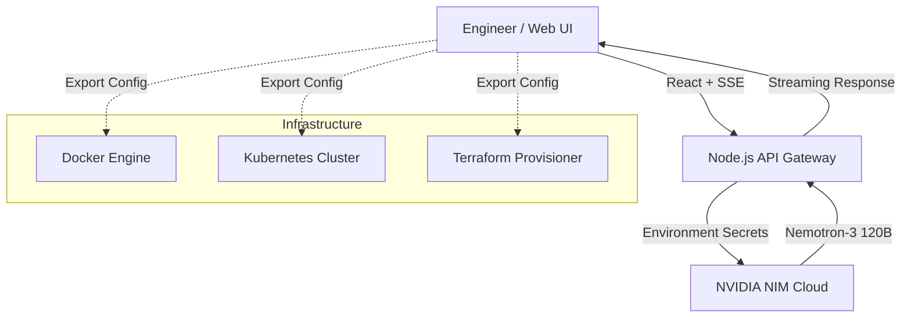

# NVIDIA AI DevOps Assistant 🚀

A specialized, professional-grade platform designed for engineers to generate production-ready infrastructure-as-code (IaC), container configurations, and automation workflows. Powered by **NVIDIA Nemotron-3 Super 120B** via the NVIDIA NIM API.

## 🛠 Features for Engineers

- **Specialized Expert Modes**:
  - **General Assistant**: Your all-purpose AI for normal questions and brainstorming.
  - **Docker Expert**: Multi-stage builds, optimization, and security best practices.
  - **Terraform Expert**: Modular IaC for AWS, Azure, and GCP.
  - **Kubernetes Master**: High-availability manifests and Helm chart blueprints.
  - **GitHub Actions Specialist**: Efficient, secure CI/CD YAML workflows.
  - **DevOps Strategist**: High-level architectural planning and GitOps flows.
- **Improved Mobile Experience**: Fully responsive interface with drawer-based tool selection for engineering on the go.
- **Production-Ready Output**: Generates code templates following industry standards instead of generic chat.
- **Interactive Code Console**:
  - **Syntax Highlighting**: Real-time formatting for dozens of languages.
  - **One-Click Copy**: Instantly copy code blocks to your clipboard.
  - **Instant Download**: Download generated configs as files (e.g., `.tf`, `.yaml`, `Dockerfile`).
- **Modern Streaming Interface**: See logic unfold in real-time with smooth server-sent events.
- **High-Performance UI**: 
  - Glassmorphism design with a "cool" technological aesthetic.
  - Sub-pixel background animations optimized for low CPU usage.
  - Fully mobile-responsive layout.

## 📐 Architecture



## 🚀 Deployment Instructions

### 1. Repository Setup
Clone the code to your machine and push to GitHub:
```bash
git init
git add .
git commit -m "Initialize DevOps Assistant"
git remote add origin YOUR_GITHUB_URL
git push -u origin main
```

### 2. Render.com Deployment
1. Connect your GitHub to [Render](https://render.com).
2. Create a **New Web Service**.
3. **Build Command**: `npm install && npm run build`
4. **Start Command**: `npm start`
5. **Environment Variables**:
   - `NVIDIA_API_KEY`: Your key from [build.nvidia.com](https://build.nvidia.com).
   - `NODE_ENV`: `production`

## 👨‍💻 Developer
- **GitHub**: [manisai901](https://github.com/manisai901)
- **Email**: manikantasaivootla@gmail.com

---

*Powered by NVIDIA Grace Hopper Architecture.*
